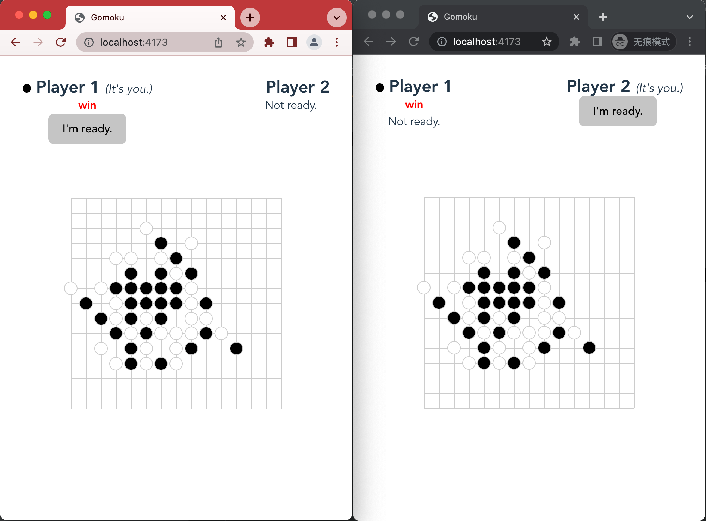

A simple online real-time gomoku server implementation.




## Install

```shell
pnpm install
```

## Run

1. Build client assets.
	```shell
	pnpm run build
	```

1. Start game server.
	```shell
	pnpm run server
	```

1. Start client server.
	```shell
	pnpm run client 
	```
  Open http://localhost:4173 in browser.

